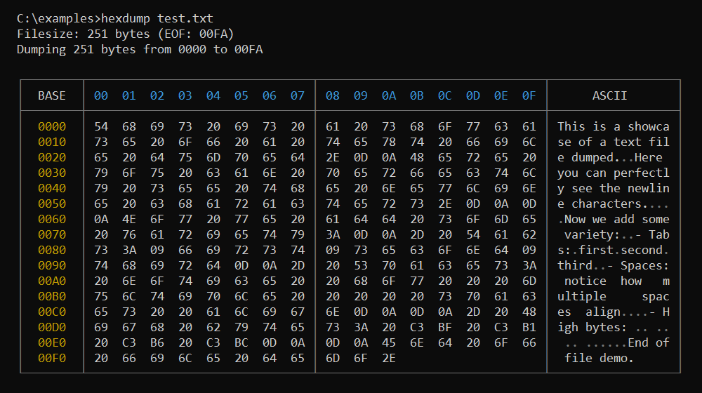
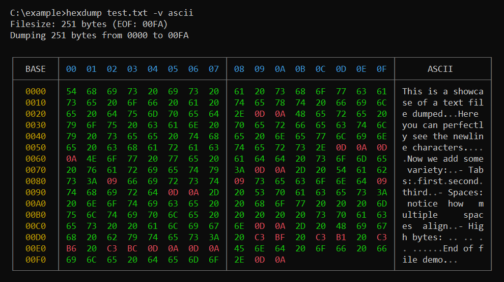

# hexdump: A tool with a lot of features
I am a windows user and it botheres me, that there is no native hexdump tool. So i decided to make my own, even better one! The tool is completely written in **[Rust](https://github.com/rust-lang/rust)** and it was a great learning experience.
## Install
You can either download the latest released pre-compiled binaries or compile the tool yourself. (When you build it yourself, you have to build the release using `cargo build --release`).<br>
After building or downloading the pre-compiled binaries, move the `hexdump.exe` into a distinct folder. For example: `C:\Users\<you>\Documents\hexdumpTool`.<br>
Then add that folder path to your **Environment Variables**, so you can use the tool in your cmd/powershell/terminal.
## How to use
You can use **hexdump** like this:
```
hexdump <FILE> [OPTIONS]
```
### Required arguments
* `<FILE>`: Path to the file to dump
### Options
* `-h, --help`: Prints the help
* `-v, --visualization`: In what style the data should be printed
* `-s, --start`: At what address the dump should start
* `-n, --num-bytes`: How many bytes should be dumped
* `-e, --end`: At what address the dump should end
## Features
**hexdump** features a lot of options:
### Visualization modes
You can set different visualization modes via the **-v** argument. Currently there are:<br>
1. `-v ascii`: Data bytes that are drawable as ascii characters are drawn green and all others red.

2. `-v zeros`: Data bytes that have the value 0 are drawn magenta and all others white.

3. `-v high`: Data bytes that are bigger than 0x80 are drawn blue and all others white.

4. `-v control`: Data bytes that are ascii control characters are drawn yellow and all others white.

### Address modes
You can use `-s`, `-n` and `-e` in different combinations:
1. `-s`: Dumps **all bytes** in the range of **start_address** to **EOF[^1]**.

2. `-n`: Dumps **n bytes** starting from **address 0**.

3. `-e`: Dumps **all bytes** in the range of **0** to **end_address**.

4. `-s -n`: Dumps **n bytes** starting from **start_address**.

5. `-s -e`: Dumps **all bytes** in the range of **start_address** to **end_address**.

6. `-n -e`: Dumps **n bytes** ending at **end_address** (therefore it starts from **end_address - (n - 1)**).

7. `-s -n -e`: Using **all address related** arguments **at the same time** results in **UB[^2]** and is therefore an **invalid argument combination**.

Notice: You can pass the value of `-s`, `-n` or `-e` either in decimal (eg: `-n 256`) or hex (eg: `-s 0x100`).

## Examples
#### First lets dump a text file with plain style:


#### Now lets take a look at the `-v` argument:
<br>


#### Lets make use of the `-n` argument on a big file!


#### Lets use a combination of our arguments!


#### How about we slice out some data from the middle of the file?


#### And finally lets make use of the `-v zeros` option!


[^1]: EOF: End Of File

[^2]: UB: Undefiend Behaviour